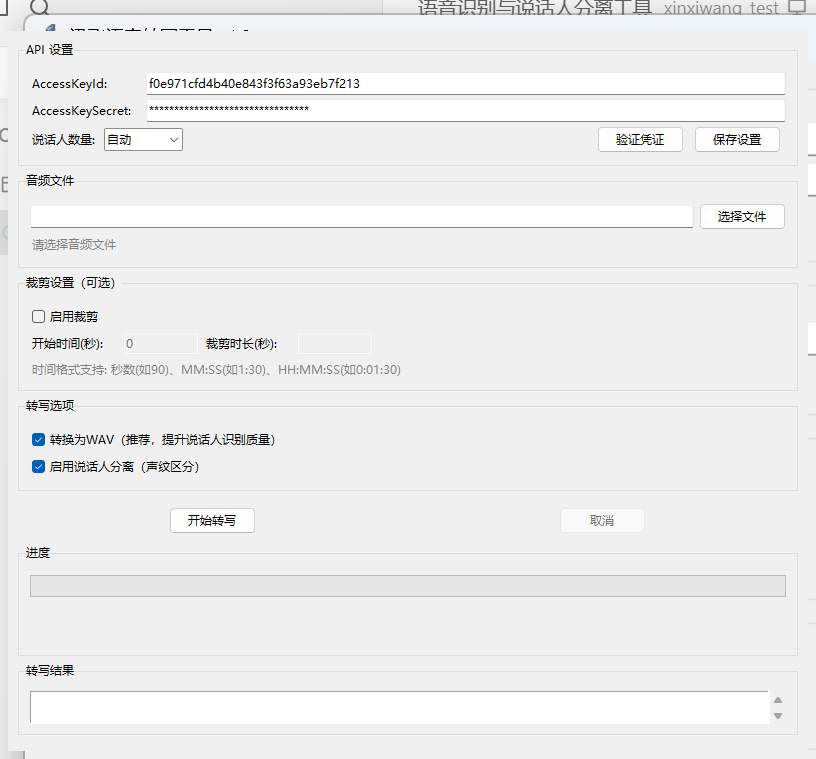

# 会议录音转录工具 — Vibecoding 项目

> 基于讯飞非实时语音转写大模型 (ifasr_llm) 的桌面端语音转写工具，支持说话人分离、音频裁剪、WAV 转换。

## [Download 下载](https://github.com/HUAHAODIA/meeting-transcriber-vibecoding/releases/latest/download/XfyunTranscriber.exe)

点击上方链接直接下载 exe，无需进入文件夹。  
Click the link above to download the exe directly — no need to browse folders.

---

## 功能 | Features

- **语音转写** — 支持 MP3 / WAV / FLAC / M4A / AAC / OGG / WMA / AMR 格式
- **说话人分离** — 基于声纹的角色区分，支持手动指定或自动检测说话人数
- **音频裁剪** — 支持按时间范围裁剪音频后再转写
- **WAV 自动转换** — 自动将音频转为 16kHz/16bit/单声道，提升识别准确率
- **进度实时显示** — 轮询进度条 + 已等待计时
- **结果导出** — 支持保存为 TXT、复制到剪贴板
- **GUI 界面** — Tkinter 桌面应用，Windows 开箱即用

## 截图 | Screenshot



## 使用方法 | Usage

1. 前往[讯飞开放平台](https://www.xfyun.cn/) 获取 **AccessKeyId** 和 **AccessKeySecret**
2. 下载 `XfyunTranscriber.exe` → 双击运行
3. 填入 API 凭证 → 点击「验证凭证」
4. 选择音频文件 → 设置说话人数量 → 点击「开始转写」
5. 等待转写完成 → 保存结果

## 开发环境 | Development

```bash
pip install -r requirements.txt
python main.py
```

> 开发时需要 [FFmpeg](https://ffmpeg.org/download.html)（将 `ffmpeg.exe` 和 `ffprobe.exe` 放入 `assets/` 目录）。

## 打包 | Build

```bash
pip install pyinstaller
pyinstaller build.spec
```

## 项目结构 | Structure

```
├── main.py              # 应用入口
├── gui.py               # Tkinter GUI 界面
├── api_client.py        # 讯飞 API 客户端 (签名/HMAC-SHA1)
├── audio_processor.py   # 音频处理 (ffmpeg/裁剪/转换)
├── result_formatter.py  # 结果解析与格式化
├── poll_manager.py      # 轮询管理器
├── config.py            # 配置管理 (凭证存储)
├── utils.py             # 工具函数
├── exceptions.py        # 自定义异常
├── assets/              # 资源文件 (ffmpeg, 图标)
├── screenshots/         # 截图
└── requirements.txt     # Python 依赖
```

## License

MIT
